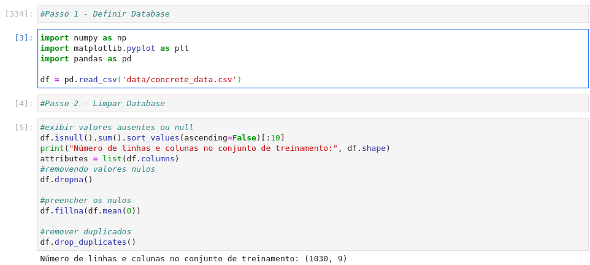
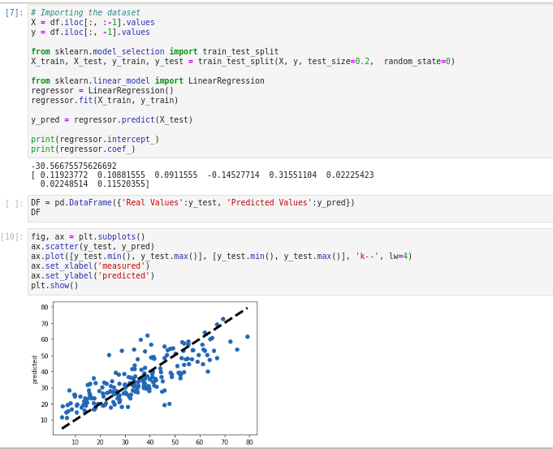
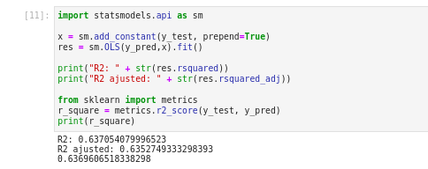
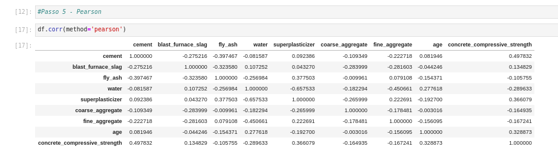
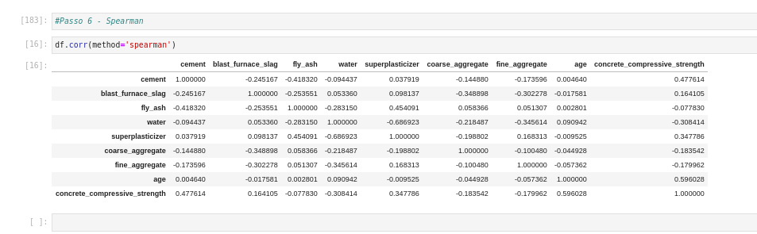

# DatabaseAnalysisProject

Projeto semestral para a matéria de Cálculo Númerico, disciplina cursada no Centro Universitário FEI. Consiste na análise de um database

## Funcionalidade

**1 - Leitura** - Realiza a leitura do database, eliminando dados duplicados, das NAN e dados faltantes. 



**2 - Regressão Linear** - Realiza a regressão linear múltipla e o gráfico da regressão.



**3 - Coeficente de Regressão** - Determinar o coeficiente de determinação R2 da regressão linear múltipla.



**4 - Coeficiente de correlação de Pearson** - Calcula o coeficiente de correlação de Pearson.



**5 - Coeficiente de correlação de Spearman** - Calcula o coeficiente de correlação de Spearman.



## Execução

Tanto no Windows quanto no Linux a execução é feita a partir da execução da linha a seguir no terminal, ou utilizando uma IDE de sua preferência. É necessário instalar certas bibliotecas antes de executar o projeto em si.

```bash
python main.py
```

O arquivo .ipynb pode ser executado também em sua plataforma de preferência, como Jupyter Notebook, Google Colab e afins, basta importar o arquivo "main.ipynb" e executar.